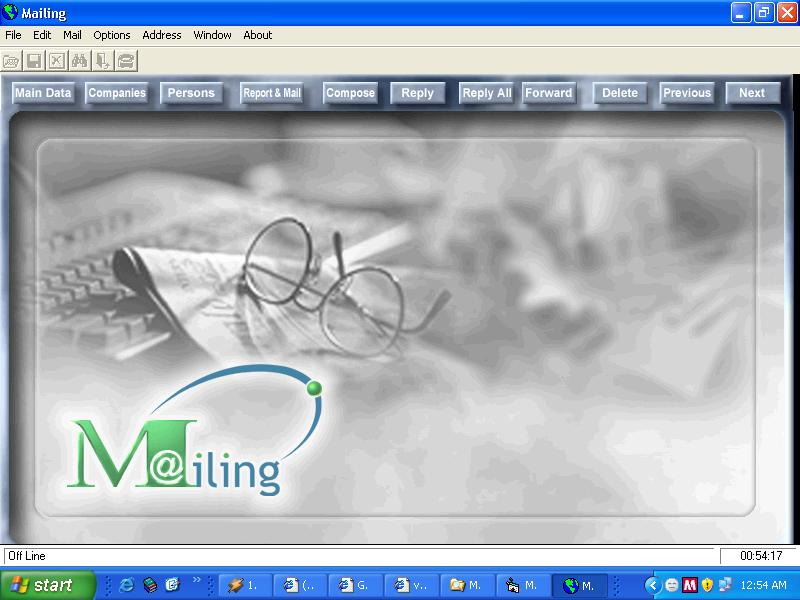



## a Contact management  \- Maliling

### Description

Mailing is integrated management system I made it to many clients. I used data base access, dao, CRW8. The application enables to save contact list information to many categories and you can print out many reports or mail labels by categories, name, products, cities, and many ways you can email any person or company one by one or as a campaign. There are a lot of options more.

PLZ do not forget voting to me
 
### More Info
 

             |
---                |---
**Submitted On**   |2007-04-01 15:54:38
**By**             |[Egyption programer](https://github.com/Planet-Source-Code/PSCIndex/blob/master/ByAuthor/egyption-programer.md)
**Level**          |Advanced
**User Rating**    |4.5 (49 globes from 11 users)
**Compatibility**  |VB 6\.0, VBA MS Access
**Category**       |[Complete Applications](https://github.com/Planet-Source-Code/PSCIndex/blob/master/ByCategory/complete-applications__1-27.md)
**World**          |[Visual Basic](https://github.com/Planet-Source-Code/PSCIndex/blob/master/ByWorld/visual-basic.md)
**Archive File**   |[a\_Contact\_205764412007\.zip](https://github.com/Planet-Source-Code/egyption-programer-a-contact-management-maliling__1-68258/archive/master.zip)

